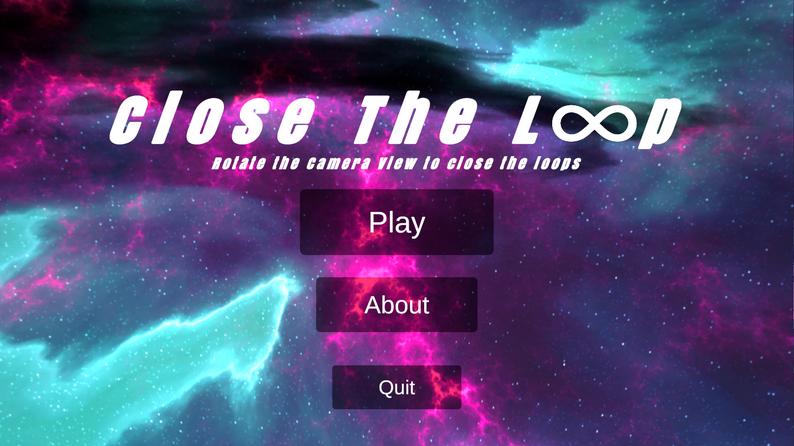
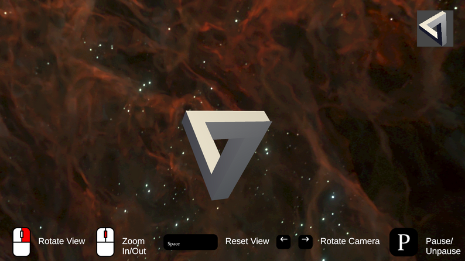
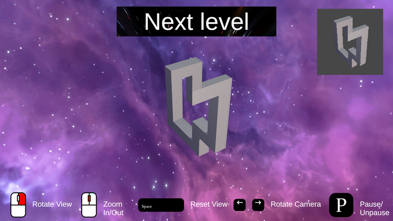
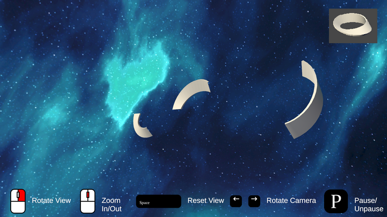

# Close The Loop — GMTK 2025

Close The Loop is a chill visual illusion puzzle game made for the GMTK 2025 Game Jam. 
Rotate the camera, hunt for the perfect angle, and watch scattered shapes snap into a satisfying continuous loop. 
What looks chaotic at first becomes a clean, seamless connection once you line things up just right. 
It’s all about perception, gentle vibes, and that little burst of joy when everything clicks.

## Features

* Smooth, minimalist camera rotation
* A collection of handcrafted visual illusion puzzles
* Instant feedback when a loop is aligned
* Relaxed pacing and no fail state
  
## Download 

https://kuruttakao.itch.io/close-the-loop

## How to Play

1. Rotate the camera using your mouse.
2. Look for shapes and segments that feel like they *almost* connect.
3. Adjust your perspective until everything forms a perfect loop.
4. Enjoy the little hit of satisfaction.

## Tech & Tools

* Built in Unity
* Uses simple shaders and clean shapes for clarity
* Designed with accessibility and low-friction play in mind

---
